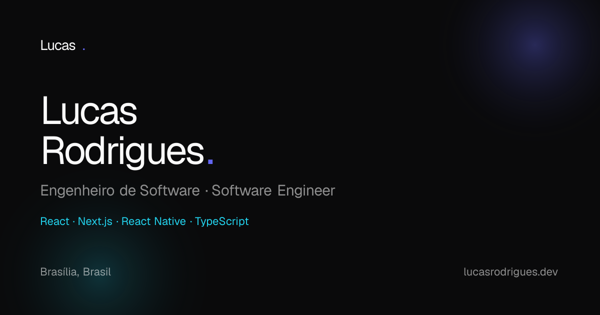
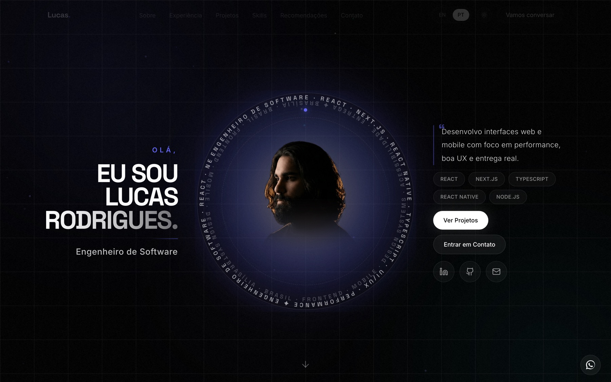
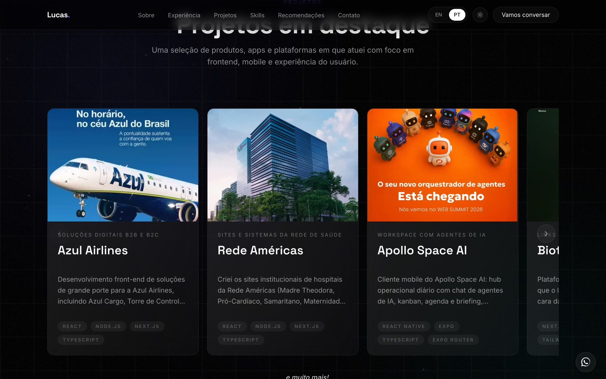

<p align="center">
  
</p>

<h1 align="center">Lucas Rodrigues</h1>

<p align="center">
  <strong>Software Engineer</strong> · Frontend & Mobile<br/>
  Crafting polished web and mobile interfaces with React, Next.js, React Native, and TypeScript.
</p>

<p align="center">
  <a href="https://lucasrodrigues.dev"></a>
  <a href="https://lucasrodrigues.dev/pt"></a>
  <a href="https://lucasrodrigues.dev/en"></a>
</p>

<p align="center">
  <a href="https://linkedin.com/in/lucas-rodrigues-515358223">LinkedIn</a> ·
  <a href="https://github.com/lucasrodbsb">GitHub</a> ·
  <a href="https://wa.me/5561982789687">WhatsApp</a> ·
  <a href="mailto:lucas.rodd61@gmail.com">Email</a>
</p>

---

## Preview

<p align="center">
  
</p>

<p align="center">
  <em>Hero — bilingual portfolio with dark theme, smooth motion, and a clear CTA path.</em>
</p>

<p align="center">
  
</p>

<p align="center">
  <em>Projects — selected work across airlines, healthcare, AI, and product interfaces.</em>
</p>

---

## About

Personal portfolio for **Lucas Rodrigues**, Software Engineer based in Brasília, Brazil.

Built to help recruiters and clients quickly understand:

- who I am
- what I’ve shipped
- which stack I use with real depth
- how to reach me (WhatsApp-first)

### Sections

| Section | What you’ll find |
| --- | --- |
| **Hero** | Positioning, stack highlights, and primary CTAs |
| **About** | Bio, location, and craft story |
| **Clients** | Brands and products I’ve worked with |
| **Experience** | Roles and professional timeline |
| **Projects** | Featured case cards (Azul, Rede Américas, Apollo, and more) |
| **Skills** | Tech expertise marquee + languages |
| **Recommendations** | Peer testimonials |
| **Contact** | Form that opens a prefilled WhatsApp message |

---

## Stack

| Layer | Tools |
| --- | --- |
| Framework | [Next.js 16](https://nextjs.org) (App Router) · React 19 · TypeScript |
| Styling | Tailwind CSS 4 · custom design tokens |
| Motion | Framer Motion · Lenis smooth scroll |
| 3D / FX | Three.js · React Three Fiber · ambient effects |
| i18n | `next-intl` (`pt` / `en`) |
| Theming | `next-themes` (light / dark) |

---

## Getting started

```bash
npm install
npm run dev
```

Open [http://localhost:3000](http://localhost:3000) — you’ll be routed to `/pt` by default.

```bash
npm run build
npm run start
```

---

## Project structure

```text
src/
├── app/                 # Routes, SEO, icons, OG images
│   └── [locale]/        # Localized homepage shell
├── components/          # UI primitives, layout, effects, providers
├── features/            # Page sections (Hero, Projects, Contact, …)
├── i18n/                # Routing + request config
├── lib/                 # Site constants, content helpers, hooks
└── messages/            # PT / EN copy
public/                  # Logos, project media, llms.txt
docs/                    # README previews
```

---

## SEO & discovery

- `robots.txt` + `sitemap.xml` with locale alternates
- Open Graph / Twitter cards (`/opengraph-image`)
- Branded favicon + Apple icon
- Web app manifest
- [`/llms.txt`](https://lucasrodrigues.dev/llms.txt) for LLM-friendly discovery

---

## License

Private portfolio project · © Lucas Rodrigues
